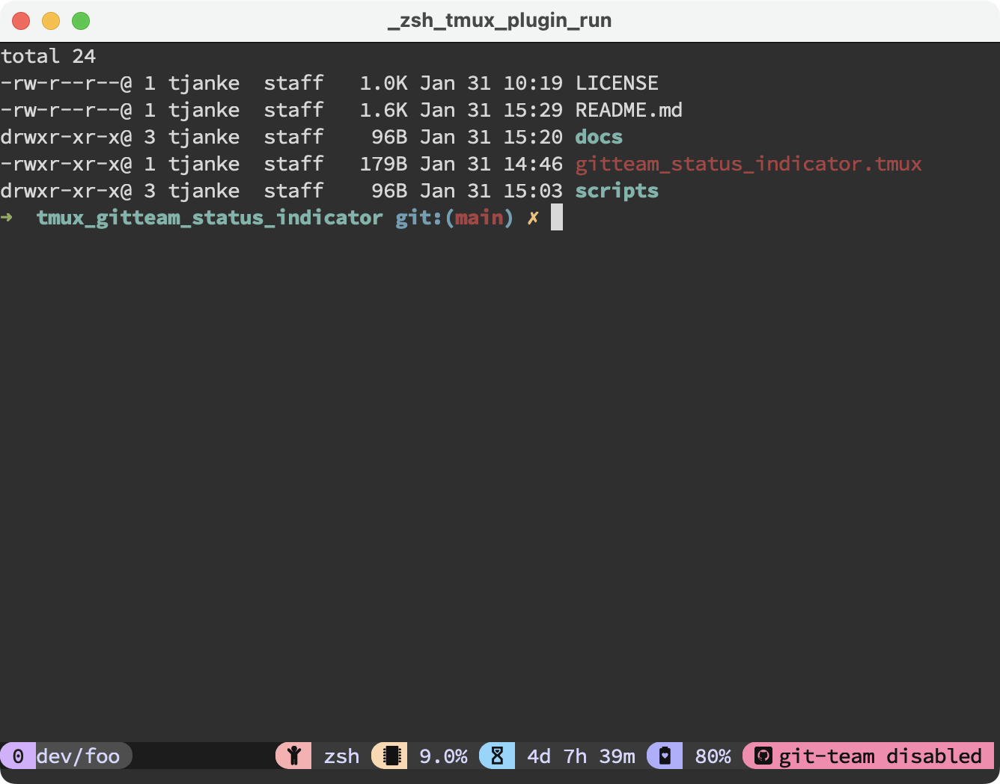
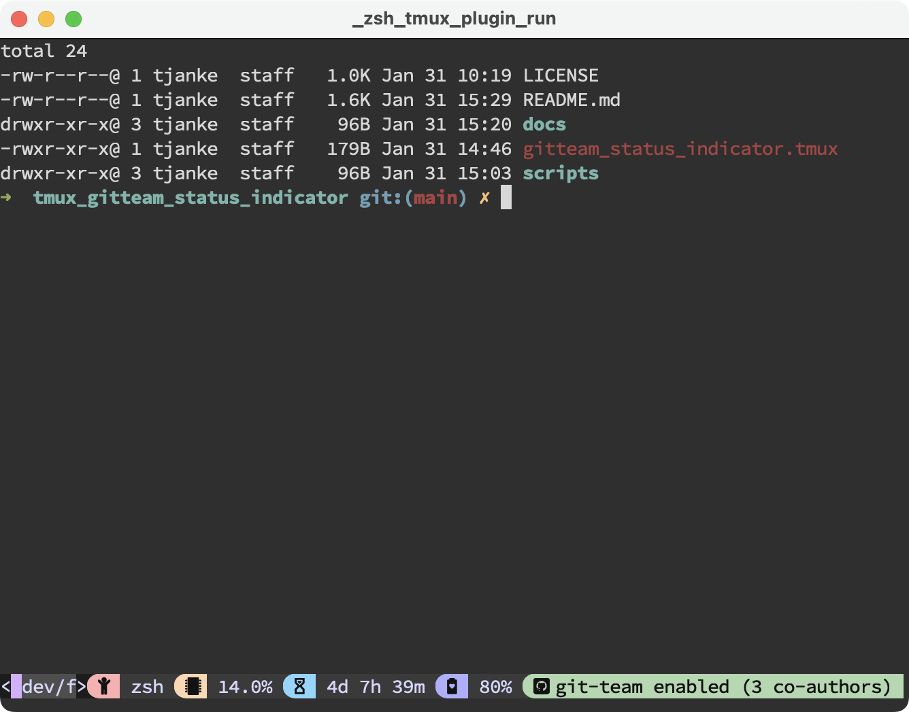
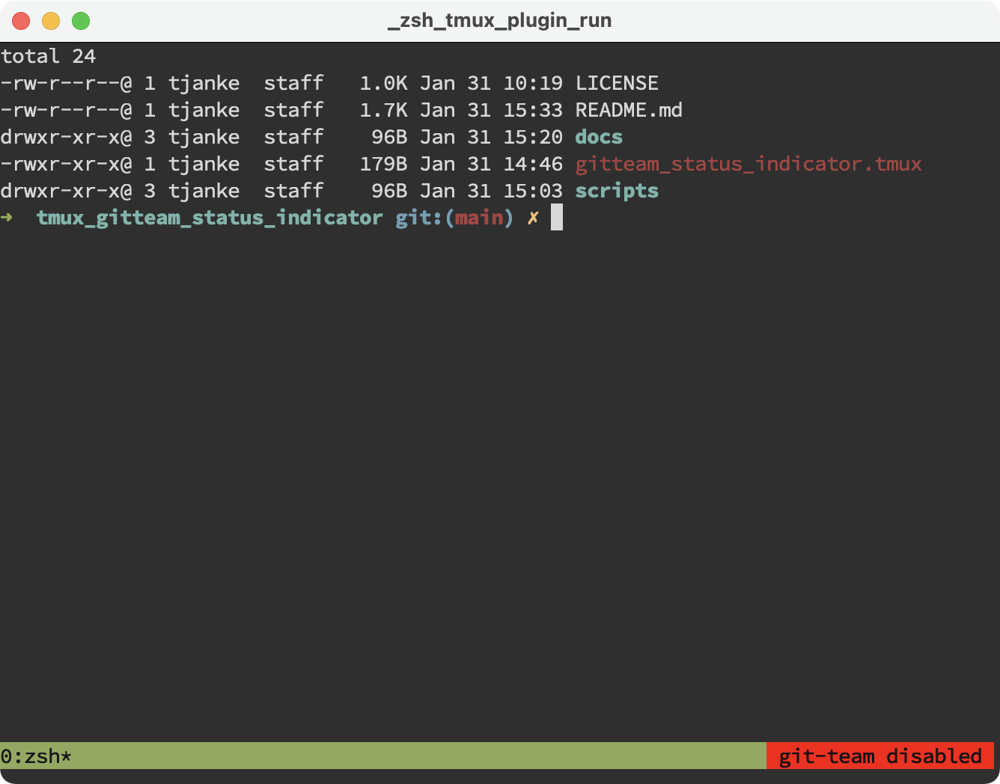
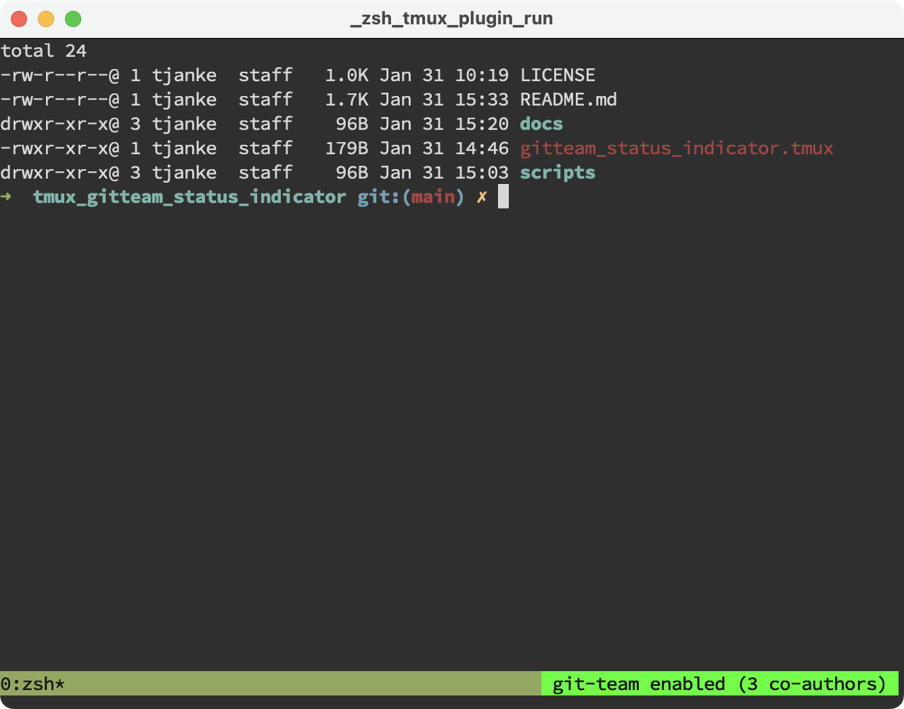

# Tmux git-team Status Indicator
A simple [TPM](https://github.com/tmux-plugins/tpm) plugin for your tmux status line to see if you have enabled your [git-team](https://github.com/hekmekk/git-team) settings or not.

## Examples

### Setup with the use of the catppuccin theme




#### Configuration

```
set -g @gitteam_status_indicator_color_enabled "#{@thm_green}"
set -g @gitteam_status_indicator_color_disabled "#{@thm_red}"
set -g @gitteam_status_indicator_icon ""
set -g @gitteam_status_section_separator_icon ""

set -ag status-right "#{E:@gitteam_status_indicator}"
```

### Basic setup




#### Configuration

```
set -ag status-right "#{E:@gitteam_status_indicator}"
```

## Installation

### Installation with TPM (recommended)

Add plugin to the list of TPM plugins in `.tmux.conf`:

    set -g @plugin 'flying7eleven/tmux-gitteam-indicator'

Hit `prefix + I` to fetch the plugin and source it.

### Manual Installation

Clone the repo:

    $ git clone https://github.com/flying7eleven/tmux-gitteam-indicator ~/clone/path

Add this line to the bottom of `.tmux.conf`:

    run-shell ~/clone/path/gitteam_status_indicator.tmux

Reload TMUX environment:

    # type this in terminal
    $ tmux source-file ~/.tmux.conf
